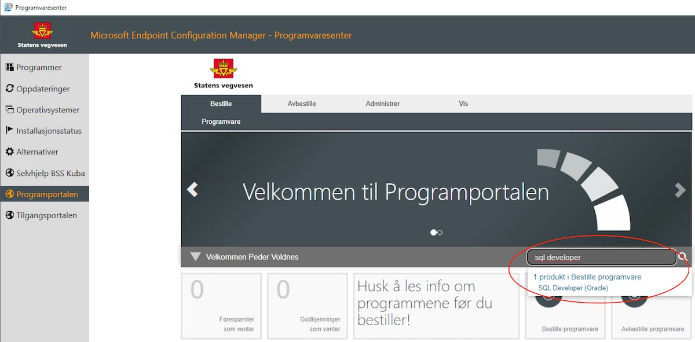

import VideoPlayer from "../../src/components/DocsComponents/VideoPlayer.tsx"

# Kom i gang med SQL Developer

Som regel vil dataene du skal utforske "on-prem" ligger i datavarehuset DataHub sin database. Dersom dette er tilfellet for deg er det et naturlig førstesteg å skaffe seg Oracle SQL Developer.

De fleste velegnede programmer for utforsking og analyse krever at man klarer å installere programmer selv i sitt virtuelle skrivebord (VDI). For å få til dette må man ha fått en test- og utviklingsbruker (TOU-bruker). Dette kan ta litt tid og det vil derfor ofte gi mening å begynne med Oracle SQL Developer, siden dette programmet kan bestilles i Programportalen uten at det trengs en TOU-bruker.

## Bestilling av SQL Developer

For å skaffe seg Oracle SQL Developer, logg først inn i din Windows VDI. Deretter, åpne opp programmet "Programvaresenter", og trykk deretter på "Programportalen" i sidemenyen. Du skal da kunne søke etter SQL Developer og bestille dette (se bildet under). Når bestillingen er lagt inn skal du forhåpentligvis få installert SQL Developer i løpet av noen timer. Om du ikke har fått programmet etter et døgn bør du opprette en POB-sak, så skal de ordne det for deg.



## Bestilling av brannmuråpning

VDI-ene kan ikke nå databasen som standard. For å få tilgang må det åpnes en port. Dette kan vi hjelpe deg med å bestille. Finn ut navnet på din VDI, og gi deretter beskjed til oss om at du har lyst å koble til databasen med denne VDI-en.

### Hvordan finne navnet på din VDI

**Dersom du har Windows**: Logg inn i din VDI. Navnet på maskinen skal stå på bakgrunnen på skrivebordet, og begynner med "SVV".

**Dersom du har Linux**: Logg inn i din VDI. Åpne opp terminalen og kjør kommandoen `hostname`. Navnet på din VDI vil så bli skrevet i terminalen.

## Førstegangs oppsett av SQL Developer

Når du har fått SQL Developer på din VDI og brannmuråpningen er på plass kan du koble til datavarehuset DataHub sin database. Åpne SQL Developer, og deretter velg "Create a Connection Manually". Tilkoblingsinformasjonen kan du finne på wiki:

[Gå til wiki-siden (må være på SVV-nett eller i VDI)](https://www.vegvesen.no/wiki/display/SSFI/Tilkobling+til+DataHub+sin+database)

**OBS**: Når du har koblet til databasen er det viktig at du endrer passordet ditt. Dette gjør du ved å høyreklikke på databasen i sidemenyen og velge "Reset Password".

Deretter kan du sjekke hvilke tabeller og views du har fått tilgang til ved å kjøre spørringene som står under. Videoen under viser hvordan du deretter kan finne et view i sidemenyen og få opp detaljvisning. Deretter kan du begynne å utforske tabellene ved hjelp av SQL.

```sql
-- Finn tabeller du har tilgang til som ikke er støyende systemtabeller
SELECT owner, table_name FROM all_tables
WHERE owner NOT IN ('SYS', 'SYSTEM', 'APEX_200200', 'ORDS_METADATA', 'GSMADMIN_INTERNAL', 'XDB', 'WMSYS', 'CTXSYS', 'ORDSYS', 'ORDDATA', 'MDSYS');


-- Finn views du har tilgang til som ikke er støyende system-views
SELECT owner, view_name FROM all_views
WHERE owner NOT IN ('SYS', 'SYSTEM', 'APEX_200200', 'ORDS_METADATA', 'GSMADMIN_INTERNAL', 'XDB', 'WMSYS', 'CTXSYS', 'ORDSYS', 'ORDDATA', 'MDSYS');
```

<VideoPlayer source="//storage.googleapis.com/saga-docs-prod_public-assets/Basic-bruk-av-sql-developer.webm" width="720px" />

**Viktig**: Det kan ofte være dårlig ytelse ved spørringer mot et view, spesielt dersom viewet fletter sammen flere tabeller. Derfor kan det være lurt å opprette en tabell fra viewet, og heller gjøre spørringer mot denne tabellen. Dette kan du [lese om i neste kapittel](/utforsking-av-persondata/greit-%C3%A5-vite-om-datavarehuset#ytelse-p%C3%A5-sp%C3%B8rringer).

## Andre tips for SQL Developer

### Import fra filer

SQL Developer støtter import fra f.eks. CSV til eksisterende tabeller. Høyreklikk på tabellen og velg "Import Data".