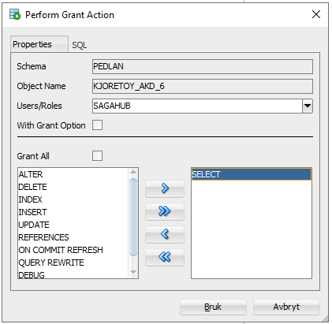

import DatahubSvg from './img/DataHub.drawio.svg';
import Tabs from '@theme/Tabs';
import TabItem from '@theme/TabItem';

# Greit å vite om DataHub sin database

Her går vi gjennom litt praktisk informasjon om DataHub sin database som kan vere greit å vite om.

## Databasens inndeling

Det er TK Innsikt som forvalter databasen, men vi har fått utdelt en del skjemaer som tilhører Saga. Et skjema i Oracle er et område hvor man kan legge egne tabeller og views. Det ligner altså litt på et datasett i Google BigQuery. Et skjema eies alltid av en databasebruker og har det samme navnet som denne brukeren. Derfor finner man de ulike skjemaene under "Other users" i Oracle SQL Developer.

Figuren under viser grovt sett hvordan databasen er oppdelt. Fra før av finnes det en del skjemaer hvor eksisterende data ligger. I tillegg har Saga fått et område hvor det ligger skjemaer både for ulike fyrtårnteams og per bruker.

<DatahubSvg width="500" height={null} style={{
}} />

Når du skal begynne med utforsking av et datasett kan du gjøre dette i ditt personlige skjema. Innhold som skal deles med resten av teamet ditt bør ligge i teamets skjema. For å kunne opprette tabeller i teamets skjema må du logge inn med teamets databasebruker. Brukernavn og passord finnes i ditt teams område i PAM.

### Flytting av data fra personlig skjema til teamets skjema

For å gjenskape eller flytte tabeller eller views i teamets skjema har du flere muligheter:

#### Gjenskape SQL
En måte er å kopiere all SQL som trengs for å lage tabellen/viewet, og kjøre dette på nytt som teamets bruker. Dersom du heller jobber i en Jupyter Notebook kan du kjøre notebooken på nytt men endre brukerinnloggingen og skrive til en tabell i teamets skjema.

#### Kopiere tabell fra ditt personlige skjema
En annen måte er å gi teamets databasebruker lesetilgang til din brukers tabeller, og deretter kopiere relevante tabeller inn i teamets skjema. Dette kan du gjøre på flere måter:

<Tabs>
  <TabItem value="sql" label="SQL" default>

Kjør følgende SQL:
```sql
GRANT SELECT ON TABLE <tabellnavn/viewnavn> TO <teamets brukernavn>
```

  </TabItem>
  <TabItem value="sqldeveloper" label="SQL Developer">

Høyreklikk på tabellen du vil dele, og velg `Privileges -> Grant`. Deretter velg teamets databasebruker, og flytt Select-rettigheten fra den venstre kolonnen til den høyre kolonnen, slik som på bildet under.



  </TabItem>
</Tabs>


Når du så har gitt teamets databasebruker lesetilgang til relevante tabeller må du logge inn som teamets bruker, og deretter opprette tabellen i teamets skjema ved å gjøre én av de følgende:

<Tabs>
  <TabItem value="sql" label="SQL" default>

Kjør følgende SQL:
```sql
CREATE TABLE <skjemanavn>.<tabellnavn> AS (
  SELECT * FROM <personlig skjema>.<tabellnavn>
)
```

  </TabItem>
  <TabItem value="sqldeveloper" label="SQL Developer">

Finn tabellen du skal kopiere i sidemenyen og høyreklikk på den. Velg deretter `Table -> Copy` og fyll ut tabellnavnet den skal ha. Husk å huke av for "Include Data", som vist på bildet under.


  </TabItem>
</Tabs>

## Ytelse på spørringer

Enkelte views kan ta lang tid å spørre mot, f.eks. fordi de fletter sammen flere tabeller. Dersom du opplever at dette gjør det vanskelig å kjøre de spørringer du trenger i din analyse er det mulig å lage en tabell basert på viewet. Dette kan gjøre at spørringer går en del raskere fordi man slipper å joine fra de opprinnelige tabellene i hver spørring. Vær oppmerksom på at dette også har ulemper der den største er at dataene i din lokale tabell ikke automatisk blir oppdatert. I tillegg vil det ta opp uforholdsmessig mye plass om alle brukere av databasen skal lage egne kopier fra alle views.

For å lage en slik kopi, kjør følgende SQL:

```sql
CREATE TABLE <skjemanavn>.<tabellnavn> AS (
  SELECT * FROM <skjema>.<viewnavn>
)
```
