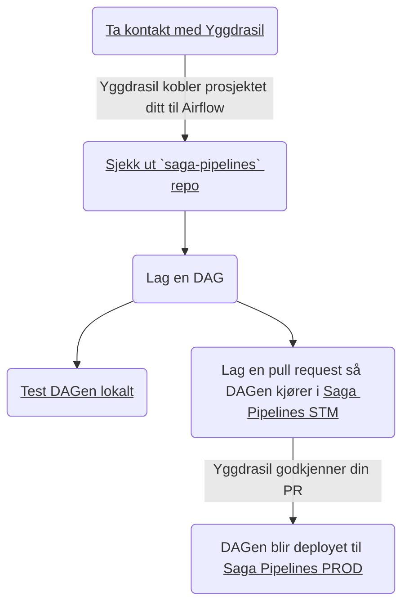
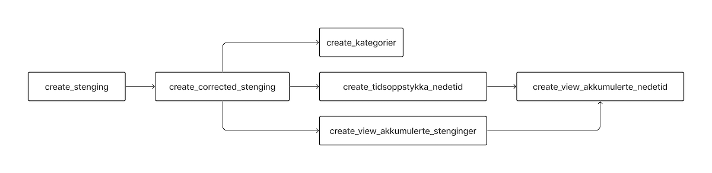

# Hvordan lage pipelines i Airflow

Følg stegene under dersom du har tenkt å bygge pipelines i Saga. Merk at det går an å trykke på flere av stegene i figuren.



## GitHub-repo for pipelines

Vi har laget et GitHub-repo [saga-pipelines](https://github.com/svvsaga/saga-pipelines) hvor koden for alle pipelines i Saga skal ligge, med mindre [pipelinen ikke egner seg for Airflow.](https://airflow.apache.org/docs/apache-airflow/stable/index.html#why-not-airflow) Dersom du mistenker at din pipeline ikke egner seg for Airflow, [ta gjerne kontakt med oss](https://vegvesen.slack.com/archives/C03LGD7TM5Z) for å diskutere hvordan pipelinen kan bygges.

## Pipelines i Airflow

Du kan se ditt teams kjørende pipelines her:

🚧 [Pipelines i STM](https://airflow-stm.saga.vegvesen.no) &nbsp;&nbsp; 🏁 [Pipelines i PROD](https://airflow.saga.vegvesen.no)

## Hvordan er pipelines bygd opp i Airflow?

Pipelines i Airflow bygges opp som en "Directed Acyclic Graph" (DAG). DAG er en graf med bokser og piler, som i eksempelet under. Boksene representerer steg i en pipeline, og pilene viser avhengighetene mellom stegene.



## Hvordan lager man en DAG?

En DAG er et Python-script som slutter på `.dag.py`. De forskjellige stegene i en DAG kalles tasks i Airflow. Det er to måter å lage tasks på, med operatorer eller med @task-annotasjon. Begge måtene blir vist i eksempelet under. Dersom du har et steg som skal kjøre Python-kode, bør @task-annotasjon benyttes. Ellers, for mer spesialiserte oppgaver, finnes det en del ferdige operatorer man kan benytte i sine tasks.

En enkel DAG kan for eksempel se slik ut:

```python
from airflow.decorators import task
from airflow.operators.bash import BashOperator
from pipeline import SagaContext, make_pipeline


def pipeline(context: SagaContext):

    # Tasks kan lages med operatorer
    print_hello_task = BashOperator(task_id="hello", bash_command="echo hello")

    # Eller med @task før en Python-funksjon
    @task()
    def print_world():
        print("world")
        print(context)

    print_world_task = print_world()

    # Avhengigheter mellom tasks settes med ">>". Slik det står her vil ping skje først og deretter email.
    print_hello_task >> print_world_task

# Det er make_pipeline-funksjonen som faktisk oppretter DAG-en i Airflow.
make_pipeline(pipeline, schedule_interval="@once")
```

### DAG med Python-kode

Dersom du vil lage en DAG som kjører Python-kode, kan pipelinen se slik ut:

```python
from pipeline import make_pipeline
from airflow.decorators import task

def pipeline(_):
    # "@task"-annotasjon kan kun brukes når man vil kjøre Python-kode i en task. Dette kalles taskflow.
    @task
    def hello():
        print("hello")
        return "world"

    @task
    def print_something(input):
        print(input)

    # For taskflow vil rekkefølgen på kall bestemme avhengighetene. Altså vil hello() kjøre før print_something(..)
    output = hello()
    print_something(output)

make_pipeline(pipeline)
```

### DAG med SQL

Det er ganske vanlig å ville kjøre et sett med SQL-spørringer i en definert rekkefølge. Det kan se slik ut:

```python
from airflow.providers.google.cloud.operators.bigquery import \
    BigQueryInsertJobOperator
from pipeline import make_pipeline

def pipeline(_):
    create_e6_stenginger = BigQueryInsertJobOperator(
        task_id="create_e6_stenginger",
        configuration={
            "query": {
                "query": """
                    CREATE OR REPLACE TABLE `{{ project_id }}.{{ dataset }}.stenginger_e6` AS
                    SELECT * FROM `saga-oppetid-prod-o6pj.curated.stenginger`
                    WHERE road = "E6"
                """,
                "useLegacySql": False,
            }
        },
    )

    stenginger_e6_i_2021 = BigQueryInsertJobOperator(
        task_id="stenginger_e6_i_2021",
        configuration={
            "query": {
                "query": """
                    CREATE OR REPLACE TABLE `{{ project_id }}.{{ dataset }}.stenginger_e6_i_2021` AS
                    SELECT * FROM `{{ project_id }}.{{ dataset }}.stenginger_e6` s
                    JOIN `saga-oppetid-prod-o6pj.curated.stenginginstanser` si ON si.stengingId = s.stengingId
                    WHERE DATE(si.startTime, 'Europe/Oslo') BETWEEN '2021-01-01' AND '2022-01-01'
                    """,
                "useLegacySql": False,
            }
        },
    )

    create_e6_stenginger >> stenginger_e6_i_2021

# default_args blir sendt videre til både tasks og templates,
# eksempelvis i SQL
default_args = {
    'dataset': 'examples'

    # project_id er automatisk tilgjengelig på lik linje med andre
    # default_args, basert på prosjektkonfigurasjonen i config.yml
}

make_pipeline(pipeline, default_args=default_args)
```

Dersom du vil se flere eksempler, har vi [flere eksempler i GitHub-repoet](https://github.com/svvsaga/saga-pipelines/tree/main/dags/yggdrasil/examples).

Dersom du vil lære mer om [hvordan DAGs fungerer, har vi skrevet om dette](./05-byggeklosser-i-en-dag.md).

## Regelmessig kjøring

Dersom du vil at din pipeline skal kjøre regelmessig kan man sende det med i det du lager pipelinen: `make_pipeline(pipeline, schedule_interval="@once")`. Blant annet kan du velge mellom:

- `None`: Kan bare trigges manuelt
- `@once`: Kjøres kun automatisk ved første deploy
- `@hourly`: Kjøres hver time
- `@daily`: Kjøres daglig

Les mer detaljert om [skedulering av pipelines](05-byggeklosser-i-en-dag.md#scheduling-og-start_date).

## Hva nå?

Når du er klar til å lage en DAG starter du med å opprette en fil som slutter på `.dag.py`. Denne må ligge i mappen `dags/<ditt team>/<domene>/`. Domene her betyr typisk det faglige domenet man jobber innenfor, og enda mer konkret skal domene-delen helst være lik som "domenedelen" av ditt GCP-prosjekt. Som et eksempel har Yggdrasil et prosjekt som heter oppetid, og derfor ligger tilhørende DAGs i `dags/yggdrasil/oppetid/`. Du kan også se hvordan koden til alle [Yggdrasil sine DAGs](https://github.com/svvsaga/saga-pipelines/tree/main/dags/yggdrasil) ser ut.

Når du har skrevet en DAG, kan du enten kjøre denne lokalt eller lage en pull request (PR) i saga-pipelines-repoet. Når man lager en PR der vil DAG-en automatisk bli deployet til [STM](https://airflow-stm.saga.vegvesen.no). Dette kan ta noen minutter. Når denne PR-en så blir flettet inn i main, blir DAG-en bli deployet til [PROD](https://airflow.saga.vegvesen.no).

🚧 [Pipelines i STM](https://airflow-stm.saga.vegvesen.no) &nbsp;&nbsp; 🏁 [Pipelines i PROD](https://airflow.saga.vegvesen.no)

## Tilbakemeldinger

Si fra på [#saga-support på Slack](https://vegvesen.slack.com/archives/C03LGD7TM5Z) hvis noe er uklart eller mangler, så skal vi forsøke utvide dokumentasjonen så snart vi kan.
