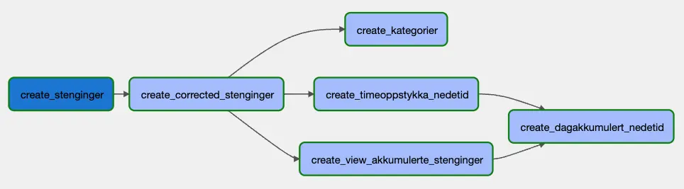

# Hvordan lage pipelines i Airflow

Pipelines i Airflow bygges opp som en "Directed Acyclic Graph" (DAG). Litt forenklet så er en DAG en graf med bokser og piler, som i eksempelet under. Boksene representerer steg i en pipeline, og pilene viser avhengighetene mellom stegene.



## Hvordan ser DAGs ut?

En DAG er bare et python-script som slutter på `-dag.py`.

En simpel DAG kan for eksempel se slik ut:

```python
from airflow.operators.http_operator import SimpleHttpOperator
from airflow.operators.email_operator import EmailOperator
from pipeline import make_pipeline

def pipeline(_)
    # Denne lager en task som kaller et endepunkt
    ping = SimpleHttpOperator(task_id="call_endpoint", endpoint="http://example.com/update/")
    # Denne lager en task som sender en epost
    email = EmailOperator(task_id="send_email", to="admin@example.com", subject="Update complete")

    # Avhengigheter mellom tasks settes med ">>". Slik det står her vil ping skje først og deretter email.
    ping >> email

# Det er make_pipeline-funksjonen som faktisk oppretter DAG-en i Airflow.
dag = make_pipeline("my_pipeline", pipeline, schedule_interval="@daily")
```

### DAG med Python-kode

Dersom du vil lage en DAG som kjører Python-kode, kan pipelinen se slik ut:

```python
from pipeline import make_pipeline
from airflow.decorators import task

def pipeline(_)
    # "@task"-annotasjon kan kun brukes når man vil kjøre Python-kode i en task. Dette kalles taskflow.
    @task
    def hello():
        print("hello")
        return "world"

    @task
    def print_something(input)
        print(input)

    # For taskflow vil rekkefølgen på kall bestemme avhengighetene. Altså vil hello() kjøre før print_something(..)
    output = hello()
    print_something(output)

dag = make_pipeline("hello_world", pipeline)
```

### DAG med SQL

Det er ganske vanlig å ville kjøre et sett med SQL-spørringer i en definert rekkefølge. Det kan se slik ut:

```python
from airflow.providers.google.cloud.operators.bigquery import \
    BigQueryInsertJobOperator
from pipeline import make_pipeline

def pipeline(_):
    create_e6_stenginger = BigQueryInsertJobOperator(
        task_id="create_e6_stenginger",
        configuration={
            "query": {
                "query": """
                    CREATE OR REPLACE TABLE `{{ project_id }}.{{ dataset }}.stenginger_e6` AS
                    SELECT * FROM `saga-oppetid-prod-o6pj.curated.stenginger`
                    WHERE road = "E6"
                """,
                "useLegacySql": False,
            }
        },
    )

    stenginger_e6_i_2021 = BigQueryInsertJobOperator(
        task_id="stenginger_e6_i_2021",
        configuration={
            "query": {
                "query": """
                    CREATE OR REPLACE TABLE `{{ project_id }}.{{ dataset }}.stenginger_e6_i_2021` AS
                    SELECT * FROM `{{ project_id }}.{{ dataset }}.stenginger_e6` s
                    JOIN `saga-oppetid-prod-o6pj.curated.stenginginstanser` si ON si.stengingId = s.stengingId
                    WHERE DATE(si.startTime, 'Europe/Oslo') BETWEEN '2021-01-01' AND '2022-01-01'
                    """,
                "useLegacySql": False,
            }
        },
    )

    create_e6_stenginger >> stenginger_e6_i_2021

# default_args blir sendt videre til både tasks og templates, f.eks. i SQL
default_args = {
    'dataset': 'examples',
}

dag = make_pipeline("find_e6_stenginger_2021", pipeline, default_args=default_args)
```

Dersom du vil lære mer om hvordan DAGs fungerer, har [vi skrevet om dette her.](#hvordan-er-dags-bygd-opp)

## Hva nå?

Når du er klar til å lage en DAG starter du med å opprette en fil som slutter på `-dag.py`. Denne må ligge i mappen `dags/<ditt team>/<domene>/`. Domene her betyr typisk det faglige domenet man jobber innenfor, og enda mer konkret skal domene-delen helst være lik som "domenedelen" av ditt GCP-prosjekt. Som et eksempel har Yggdrasil et prosjekt som heter oppetid, og derfor ligger tilhørende DAGs i `dags/yggdrasil/oppetid/`. Koden til alle [Yggdrasil sine DAGs kan sees her.](https://github.com/svvsaga/saga-pipelines/tree/main/dags/yggdrasil)

Når du har skrevet en DAG, kan du enten kjøre denne lokalt eller lage en pull request (PR) i saga-pipelines-repoet. Når man lager en PR der vil DAG-en automatisk bli deployet til [STM](https://bba5347ed7ee4031a042db3c1ddc8410-dot-europe-west1.composer.googleusercontent.com/). Dette kan ta noen minutter. Når denne PR-en så blir flettet inn i main, blir DAG-en bli deployet til [PROD](https://317df360d876468ba7f411edbec769e1-dot-europe-west1.composer.googleusercontent.com/).

## Testing

En grunnleggende test av alle DAGs vil bli kjørt i PRs og før deploy, som vil sjekke at det er gyldig Python-kode og imports. Disse kan kjøres med

```sh
source activate.sh
pytest test_dags.py
```

Andre tester kan legges til i samme mappe som DAGen.

## Kjøre Airflow lokalt

Du kan kalle `./start-airflow.sh` for å kjøre opp Airflow lokalt (krever Docker og `docker-compose`).

Airflow vil være tilgjengelig på http://localhost:8080, med innlogging brukernavn og passord begge satt til `airflow`.

Det settes opp directory-mapping fra din lokale mappe til Airflow:

- DAGs vil leses fra `build/`-mappa
- Plugins leses fra `plugins/`-mappa

For å kjøre Airflow CLI-kommandoer kan du bruke `npm run airflow <args>` (krever `docker-compose`), f.eks.:

```shell
npm run airflow dags list
```

### Bygge og teste DAGs lokalt

Hvis du har Airflow kjørende lokalt, kan du kjøre dine DAGs der.

1. For å slippe å gjenta deg selv kan du sette path til DAGen som en variabel: `export DAG=dags/yggdrasil/oppetid/hendelser-dag.py`
1. Hvis du har en Dockerfile som skal bygges:
   1. Velg deg en unik tag, f.eks. ditt brukernavn på 6 bokstaver, og sett denne: `export TAG=geisag`
   1. Kjør `python build_docker_images.py $TAG $DAG`
1. Kjør `python build_dags.py [--tag $TAG] STM $DAG`. Dette vil bygge DAGen (evt. med docker-image-tag) og erstatte templated fields. Du kan se resultatet i `build/`.
1. Din lokale Airflow vil automatisk plukke opp DAGs som ligger i `build/`-mappa.
1. Så lenge du er logget inn i `gcloud` med `gcloud auth application-default login` vil Airflow bruke dine credentials. Sørg for at du har rettigheter til å impersonate project service accounten for DAGens prosjekt.

Dersom din DAG ikke dukker opp, kan du feilsøke:

```shell
npm run airflow dags list-import-errors
```

Du kan også kjøre DAGs direkte for testing:

```shell
npm run airflow dags test oppetid_hendelser 2022-01-01
```

Du vil da få log output rett i terminalen, som kan være nyttig for feilsøking.

## Hvordan er DAGs bygd opp?

En DAG består av én eller flere tasks. Tasks kan lages på to ulike måter:

- [Operators](https://airflow.apache.org/docs/apache-airflow/stable/concepts/operators.html)
- [Taskflow](https://airflow.apache.org/docs/apache-airflow/stable/tutorial/taskflow.html)

### Operators

Det finnes et utall ferdiglagde operatorer. Noen nyttige eksempler er:

- [BigQueryInsertJobOperator](https://airflow.apache.org/docs/apache-airflow-providers-google/stable/operators/cloud/bigquery.html)
- [SimpleHttpOperator](https://airflow.apache.org/docs/apache-airflow-providers-http/stable/operators.html#simplehttpoperator)

[Se flere innebygde operators her](https://airflow.apache.org/docs/apache-airflow/stable/concepts/operators.html) og [operators for GCP her.](https://airflow.apache.org/docs/apache-airflow-providers-google/stable/operators/cloud/index.html)

### Make_pipeline

Vi har i tillegg laget en wrapper `make_pipeline` som automatisk setter inn nødvendige variabler for tilgangsstyring.

Her er et eksempel som kjører en spørring mot BigQuery:

```python
from airflow import models
from airflow.providers.google.cloud.operators.bigquery import BigQueryInsertJobOperator
from pipeline import SagaContext, make_pipeline


# Pipelinen defineres i en funksjon som får inn en `SagaContext` med nyttig info
def pipeline(context: SagaContext):
    create_corrected_stenginger = BigQueryInsertJobOperator(
        task_id="create_corrected_stenginger",
        configuration={
            "query": {
                # Her leses en SQL fil inn, den må ligge i samme mappe
                "query": "",
                "useLegacySql": False,
            }
        },
        location="EU",
    )


# Disse variablene kan brukes inne i SQL-filer med Jinja
default_args = {
    "dataset": "curated",
    "nvdbConsumerDataset": "saga-nvdb-consumer-prod-2p3w.consumer"
    # Flere variabler vil automatisk settes inn her, se docs nedenfor
}


# Man -må- lagre resultatet som `dag` for at Airflow skal plukke opp pipelinen.
dag = make_pipeline("stenginger", pipeline, schedule_interval='@daily', default_args=default_args)
```

Vi bruker [Jinja templates](https://airflow.apache.org/docs/apache-airflow/stable/templates-ref.html) for å inkludere SQL-filer og sette inn variabler i disse.

### Hooks

Operatorer er som regel bygd opp av [Hooks](https://airflow.apache.org/docs/apache-airflow/stable/concepts/connections.html#hooks): et høynivå interface mot en integrasjon. Man kan f.eks. bruke en hook for å forenkle tilkobling til BigQuery hvis man vil skrive ren Python-kode (uten `BigQueryInsertJobOperator`):

```python
from airflow.providers.google.cloud.hooks.bigquery import BigQueryHook
from airflow.decorators import task
from pipeline import SagaContext, make_pipeline


def pipeline(context: SagaContext):
    @task
    def copy_table():
        hook = BigQueryHook(impersonation_chain=context.impersonation_chain)
        bq = hook.get_client(project_id=context.project_id, location="EU")

        bq.copy_table(
            source_project_dataset_table=f"{context.project_id}.curated.stenginger",
            destination_project_dataset_table=f"{context.project_id}.curated.stenginger_copy",
        )

    copy_table()

dag = make_pipeline("copy-stenginger", pipeline)
```

## Automatikk og variabler

DAGer i `dags/` vil prosesseres ved bygging, og resultatet vil bli plassert i `build/`. Følgende transformasjoner gjøres:

- `__PROJECT_ID__` og enkelte andre variabler byttes rått ut med sine respektive verdier, se lenger ned for flere variabler.
- `make_pipeline` får injected `project_id`, `project_base` og `team`, som brukes til å bygge opp `SagaContext` som sendes til pipelinen.
- `make_pipeline` vil sette en del `default_args` for DAGen, som bl.a. håndterer tilgangsstyring mot GCP og automatisk Slack alerts til teamets Slack-kanal
  - Som standard vil alle kall til GCP gjøres med prosjektets service account `project-service-account@<projectId>.iam.gserviceaccount.com`.
  - `default_args` vil også sendes inn some `user_defined_macros` hvis man bruker [Jinja templates](https://airflow.apache.org/docs/apache-airflow/stable/templates-ref.html).
- Andre argumenter til `make_pipeline` vil bli sendt videre til [`DAG`-konstruktøren](https://airflow.apache.org/docs/apache-airflow/stable/_api/airflow/models/dag/index.html#airflow.models.dag.DAG).

### Saga-variabler

Her er en liste over våre egne variabler du kan bruke:

| Variabel           | Beskrivelse                                                                                                                                                                                                                                                |
| ------------------ | ---------------------------------------------------------------------------------------------------------------------------------------------------------------------------------------------------------------------------------------------------------- |
| `__PROJECT_ID__`   | Erstattes med STM project ID for PRer, og PROD project ID ved merging til main. Leses fra `projects.config.json` i DAGens mappe.                                                                                                                           |
| `__IMAGE__`        | Dersom det finnes en Dockerfile i DAGens mappe, vil denne settes til imaget, inkludert tag, f.eks. `europe-docker.pkg.dev/saga-artifacts/docker/dags/yggdrasil/oppetid:pr-13`.                                                                             |
| `__PROJECT_BASE__` | Project ID uten saga-prefix, miljø eller random suffix. F.eks. for `saga-oppetid-stm-6cgp` vil `project_base` være `oppetid`. Vil matche navnet på katalogen som DAGene ligger i. Brukes for å referere til f.eks. service accounts eller GCP connections. |

Disse vil erstattes automatisk i DAGen.

### Annen service account og tilgangsstyring

Hvis du ønsker å bruke en annen service account i ditt prosjekt, må du manuelt tildele `roles/iam.serviceAccountTokenCreator`-rollen for denne SAen til Pipeline-prosjektets project SA:

```
gcloud iam service-accounts add-iam-policy-binding my-service-account@my-project.iam.gserviceaccount.com \
  --project my-project \
  --member project-service-account@saga-pipelines-stm.iam.gserviceaccount.com \
  --role roles/iam.serviceAccountTokenCreator
```

Dette må gjøres separat for `saga-pipelines-stm` og `saga-pipelines-prod`.

Deretter må man sende med denne service accounten som `impersonation_chain` i GCP-operatoren:

```python
    create_corrected_stenginger = BigQueryInsertJobOperator(
        task_id="create_corrected_stenginger",
        configuration={...},
        impersonation_chain="my-service-account@my-project.iam.gserviceaccount.com"
    )
```

### Scheduling og `start_date`

Les https://airflow.apache.org/docs/apache-airflow/1.10.1/scheduler.html.

Relevant:

Når du lager en DAG kan du bestemme hvor ofte den skal kjøres ved å definere et `schedule_interval`.
Man kan bruke et [CRON-uttrykk](https://crontab.guru/), eller noen keywords, f.eks.:

- `None`: Kan bare trigges manuelt
- `@once`: Kjøres kun automatisk ved første deploy
- `@daily`: Kjøres daglig

`make_pipelines` har en default `start_date` satt til **2022-01-01**. Dette har som regel lite å si, med mindre din pipeline eksplisitt benytter [`data_interval_start` og/eller `data_interval_end`](https://airflow.apache.org/docs/apache-airflow/stable/faq.html#what-does-execution-date-mean). Dersom du likevel ønsker å overskrive `start_date`, kan du sende med dette som argument til `make_pipeline`.

Gotchas:

- `start_date` bør ikke endres; dette vil skape en helt ny DAG.
- Hvis `start_date` er i fortiden, vil Airflow kjøre én gang for nyeste intervall. Dersom man ønsker å ta igjen alle kjøringer siden `start_date` kan man sette `catchup=True`.
- DAGen vil kjøre ved slutten av hvert intervall.
- DAGen vil kjøre øyeblikkelig hvis `start_date` er i fortiden. Ønsker man å vente med første kjøring til midnatt, sett f.eks. `start_date` til dagens dato og `schedule_interval='@daily'`.

## Python modules

Hvis du ønsker å splitte opp koden i flere Python-filer, må du importere dem basert på hvor de ligger i `dags/`, f.eks. hvis de ligger i `utils.py` i samme mappe som en DAG i `dags/yggdrasil/oppetid`:

```python
from yggdrasil.oppetid.utils import do_stuff
```

Mer info om best practices for modules: https://airflow.apache.org/docs/apache-airflow/stable/modules_management.html#best-practices-for-module-loading.

## Docker og CloudRunOperator

Du kan bruke Docker for å kjøre tasks basert på egne images, f.eks. dbt. Vi har laget funksjonalitet som automatisk bygger og deployer en Dockerfile i samme mappe som en dag.

- Lag en Dockerfile i samme mappe som DAGen, f.eks.:

```dockerfile
FROM europe-docker.pkg.dev/saga-artifacts/docker-public/dbt-base

COPY ./dbt /dbt

WORKDIR /dbt

RUN dbt deps

ENTRYPOINT $CMD
```

- Denne Dockerfila bruker vårt base-image med DBT og gcloud installert, kopierer over dbt-prosjektet fra `/dbt`, setter workdir til `/dbt` og installerer `dbt deps`.
- Siden `ENTRYPOINT` er satt til `$CMD`, er det mulig å sende med en miljøvariabel `CMD` når man starter imaget, som gjør at imaget kan brukes til mange forskjellige operasjoner.
- Man kan kalle imaget i [Cloud Run Jobs](https://cloud.google.com/run/docs/create-jobs) ved å bruke vår egen `CloudRunOperator`:

```python
    dbt_seed = CloudRunOperator(
        task_id="dbt_seed",
        cmd='dbt seed --target release --vars {"project_id":"%s"}' % project_id,
    )
```

Merk: Imaget som bygges automatisk vil bli sendt inn som `default_args.image` og bli med i alle `CloudRunOperators`; hvis man ønsker å bruke et annet image må man spesifisere dette via `image`-parameter til `CloudRunOperator`.

### Colima

Hvis du bruker container runtimen Colima på macOS eller Linux isteden for feks Docker Desktop, må du eksportere dens socket slik at bibliotek som pythonbiblioteket `docker` finner koblingen til den.

```
export DOCKER_HOST=unix://$HOME/.colima/default/docker.sock
```
