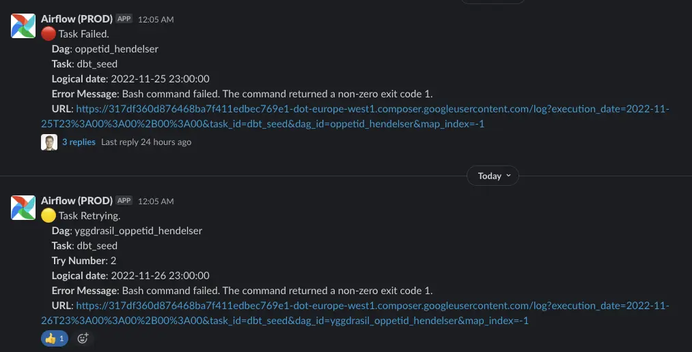
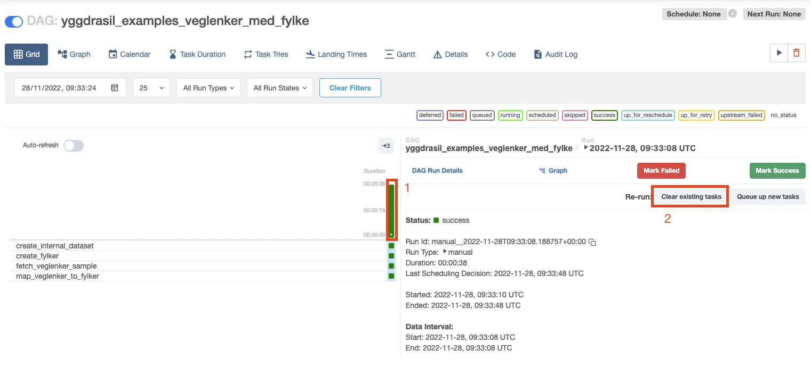
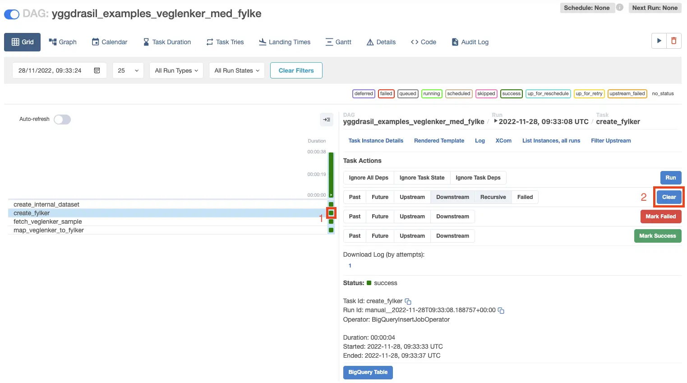

# Feilvarsling og håndtering i Airflow

Av og til kan en pipeline feile; det kan skyldes at den ikke er satt opp riktig, eller det kan være midlertidige feil som nettverksfeil etc.

Vi ønsker å få beskjed om når en pipeline feiler, slik at vi kan undersøke og rette opp i feilen, og eventuelt kjøre hele pipelinen eller deler av den på nytt.

## Beste praksis

- Anta at ethvert steg kan feile. Det betyr at steget må kunne kjøres på nytt uten å skape trøbbel:
  - Bruk f.eks. `CREATE TABLE IF NOT EXISTS` eller `CREATE OR REPLACE TABLE` for å lage tabeller.
  - Mer info: https://docs.astronomer.io/learn/dag-best-practices#review-idempotency

## Automatiske retries

Airflow er satt opp til at tasks ikke automatisk kjøres på nytt; dvs. at hvis én task feiler, vil hele pipelinen feile.

Man kan overstyre dette ved å sende med f.eks. `retries=3` til `make_pipeline` for å kjøre feilende tasks opp til 3 ganger på nytt:

```python
from pipeline import make_pipeline

def pipeline(_):
  ...

# Vil gjelde for alle tasks
dag = make_pipeline('my_pipeline', pipeline, retries=3)
```

Retries kan også settes på task-nivå:

```python
from pipeline import make_pipeline
from airflow.providers.google.cloud.operators.bigquery import BigQueryInsertJobOperator

def pipeline(_):
  create_table = BigQueryInsertJobOperator(
    task_id="create_table",
    configuration={
      "query": {
          "query": "",
          "useLegacySql": False,
      }
    },
    # Vil gjelde bare for denne tasken
    retries=3
  )

dag = make_pipeline('my_pipeline', pipeline)
```

## Alerts til Slack

Hvert team har en egen Slack-kanal i Sagas Slack, på formen `#<teamnavn>-alerts`. Som standard vil alle meldinger om retries og feil havne her, og se slik ut:



Her ser vi én melding om en feilende task, og én melding om en retry. Begge kommer fra `Airflow (PROD)`. Man kan klikke på linken for å komme rett til feilmeldingen i loggen i Airflow.

### Overstyre Slack-kanal

Hvis man ønsker å få alerts i en annen Slack-kanal, eller skru av alerts, kan dette gjøres ved å sende med `slack_failure_channel` for feil, eller `slack_retry_channel` for retries:

```python
...

dag = make_pipeline('my_pipeline', pipeline,
  # Kanalen må eksistere i Sagas Slack
  slack_failure_channel='#my-custom-channel',
  # Hvis man sender med en tom streng vil alerts bli skrudd av
  slack_retry_channel='')
```

## Kjøring av DAGs og tasks på nytt

Hvis man ønsker å kjøre en pipeline eller en oppgave på nytt, enten den har feilet eller kjørt vellykket, kan man gjøre dette ved å "cleare" status for DAGen eller oppgaven:



For å kjøre en DAG pånytt:

1. Først velger du DAG-kjøringen ved å klikke på kolonnen vist
1. Deretter, velg "Clear existing tasks"



For å kjøre en task pånytt:

1. Først velg den lille firkanten som representerer den gitte tasken for den gitte kjøringen
1. Deretter, velg "Clear"
