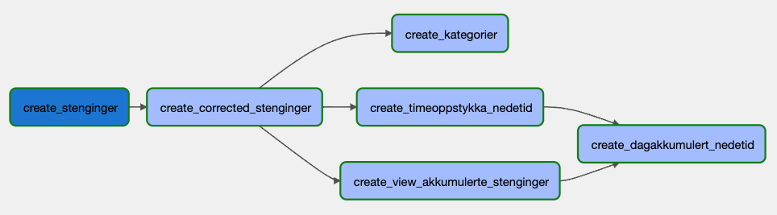
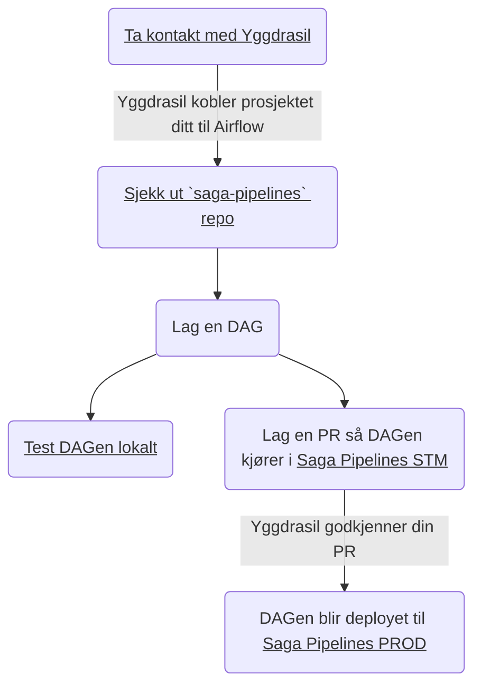

# Hvordan bygge pipelines i Saga

En pipeline er en prosess der data flyter fra ett sted via et eller flere steg til et annet sted. Dette kan for eksempel være ren innhenting av rådata, transformering av data fra en form til en annen eller sammenstilling av flere datakilder.

Når man bygger pipelines med flere transformasjonssteg er det fort gjort å miste oversikten. For å unngå dette bør man ta i bruk en strukturert løsning for å koble transformasjoner sammen. Denne prosessen kalles orkestrering. En orkestreringsløsning har tre hovedfunksjoner:

- **Samlende funksjon** – samle alle pipelines på ett sted
- **Beskrivende funksjon** – pipelinen kan visualiseres som en graf av steg som skal kjøres
- **Kjøre stegene på riktig måte til riktig tid** - løsningen tar seg av tidsplanlegging, rekkefølge, omprøving, o.l.

Saga tilbyr en ferdig oppsatt orkestreringstjeneste basert på [Cloud Composer](https://cloud.google.com/composer/docs/composer-2/composer-overview), som er GCP sin tjeneste for [Apache Airflow](https://airflow.apache.org/docs/apache-airflow/stable/concepts/overview.html).

_Figur: Eksempel på hvordan en pipeline visualiseres i Airflow_

Dette kapittelet handler i hovedsak om hvordan bygge pipelines i Airflow. Om du vil lese mer om ulike typer pipelines har vi skrevet [en side om dette her.](/utvikling-paa-saga/pipelines)

## Saga Pipelines

Vi har laget et GitHub-repo [saga-pipelines](https://github.com/svvsaga/saga-pipelines) hvor koden for alle pipelines i Saga skal ligge, med mindre [pipelinen ikke egner seg for Airflow.](https://airflow.apache.org/docs/apache-airflow/stable/index.html#why-not-airflow) Dersom du mistenker at din pipeline ikke egner seg for Airflow, [ta gjerne kontakt med oss](https://vegvesen.slack.com/archives/C03LGD7TM5Z) for å diskutere hvordan pipelinen kan bygges.

## Hvordan gå frem for å bygge pipelines i Saga

Følg stegene under dersom du har tenkt å bygge pipelines i Saga. Merk at det går an å trykke på flere av stegene i figuren.

## Tilbakemeldinger

Si fra på [#saga-support på Slack](https://vegvesen.slack.com/archives/C03LGD7TM5Z) hvis noe er uklart eller mangler, så skal vi forsøke utvide dokumentasjonen så snart vi kan.