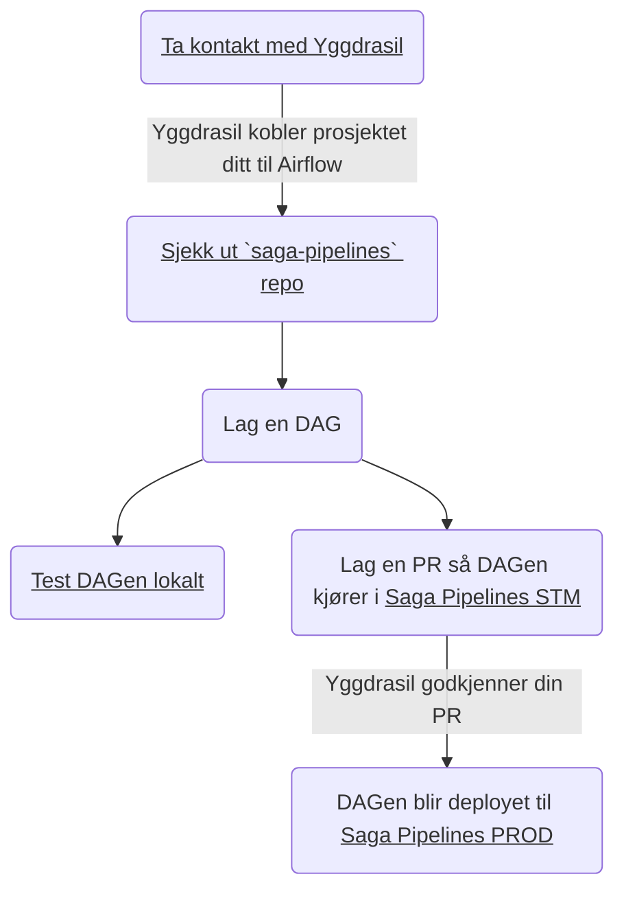

# Hvordan få data inn i Saga

```mermaid
graph TD
  A(<u>Ta kontakt med Yggdrasil</u>) --> |Yggdrasil kobler prosjektet ditt til Airflow|B
  click A href "https://vegvesen.slack.com/archives/C03LGD7TM5Z" "Åpne #saga-support i Slack" _blank
	B(<u>Sjekk ut `saga-pipelines` repo</u>) --> C
  click B href "https://github.com/svvsaga/saga-pipelines" _blank
  C(Lag en DAG) --> D
	C --> E
  D(<u>Test DAGen lokalt</u>)
  click D "https://github.com/svvsaga/saga-pipelines#kj%C3%B8re-airflow-lokalt" _blank
  E(Lag en PR så DAGen kjører i <u>Saga Pipelines STM</u>) --> |Yggdrasil godkjenner din PR|F
  click E href "https://console.cloud.google.com/composer/environments/detail/europe-west1/saga-pipelines-stm-composer/dags?project=saga-pipelines-stm" _blank
  F(DAGen blir deployet til <u>Saga Pipelines PROD</u>)
  click F href "https://console.cloud.google.com/composer/environments/detail/europe-west1/saga-pipelines-prod-composer/dags?project=saga-pipelines-prod" _blank
```
